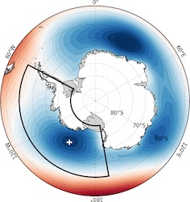

# ASLI (Amundsen Sea Low Index)


[](https://github.com/antarctica/asli)
[](https://antarctica.github.io/asli/)

<p align="center">
  
</p>

The Amundsen Sea Low (ASL) is a highly dynamic and mobile climatological low pressure system located in the Pacific sector of the Southern Ocean. In this sector, variability in sea-level pressure is greater than anywhere in the Southern Hemisphere, making it challenging to isolate local fluctuations in the ASL from larger-scale shifts in atmospheric pressure. The position and strength of the ASL are crucial for understanding regional change over West Antarctica.

This is a python package (`asli`) which implements the ASL calculation methods described in [Hosking *et al.* (2016)](http://dx.doi.org/10.1002/2015GL067143) to identify, plot and publish sea level pressure minima. Whilst the default behaviour is bounded to the Amundsen Sea area, the package will extract the pressure minima from ERA5 data over time for any rectangular geographic area of the sea.

If you're looking for the regularly updated ASLI dataset, it will soon be published with the [Polar Data Centre](https://data.bas.ac.uk/) - but for now it can be downloaded from <https://files.bas.ac.uk/twins/asli/asli_calculation_latest.csv>.

More information can be found at <https://scotthosking.com/asl_index>

Documentation for the `asli` package can be found at <https://antarctica.github.io/asli>.

**Note on versioning:** For reproducible workflows, we suggest pinning the exact version of the package in your `requirements.txt`, `pyproject.toml` or similar since we can not guarantee non-breaking changes between versions.

## Installation and Basic Usage

Install with pip (we recommend using a virtual environment):

```sh
pip install bas-asli
```

The following covers the most basic usage of the package, for full details see [the documentation](https://antarctica.github.io/asli).

Download mean sea level pressure data from the Climate Data Store (CDS) using the command-line interface:

```sh
asli download
```

**Note** that use of CDS requires registration, set up an API key as per the CDS how to: <https://cds.climate.copernicus.eu/how-to-api>

Download a land-sea mask:

```sh
asli download --lsm
```

Calculate the monthly pressure minima:

```sh
asli calc --output asli.csv
```


## Citation

If using the `asli` package please cite both this repository (see "Cite this repository" at the top right on GitHub), as well as the original paper, e.g.

> Hosking, J. S., A. Orr, T. J. Bracegirdle, and J. Turner (2016), Future circulation changes off West Antarctica: Sensitivity of the Amundsen Sea Low to projected anthropogenic forcing, Geophys. Res. Lett., 43, 367–376, doi:10.1002/2015GL067143.

>  Wyld, D., Zwagerman, T. and Hosking, J. S. asli [Computer software]. https://github.com/antarctica/asli

The ASL calculation is derived from ERA5 data downloaded from the Copernicus Climate Data Store. These should be cited as follows:

> Copernicus Climate Change Service (2023): ERA5 hourly data on single levels from 1940 to present. Copernicus Climate Change Service (C3S) Climate Data Store (CDS), DOI: 10.24381/cds.adbb2d47 (Accessed on DD-MMM-YYYY)

> Hersbach, H., Bell, B., Berrisford, P., Biavati, G., Horányi, A., Muñoz Sabater, J., Nicolas, J., Peubey, C., Radu, R., Rozum, I., Schepers, D., Simmons, A., Soci, C., Dee, D., Thépaut, J-N. (2018): ERA5 hourly data on single levels from 1940 to present. Copernicus Climate Change Service (C3S) Climate Data Store (CDS), DOI: 10.24381/cds.adbb2d47 , (Accessed on DD-MMM-YYYY)

See the [ECMWF wiki for further information on citing ERA5](https://confluence.ecmwf.int/display/CKB/Use+Case+2%3A+ERA5+hourly+data+on+single+levels+from+1940+to+present).


## Contact

The maintainers of this repository are David Wyld ([@davidwyld](https://github.com/davidwyld/)) and Scott Hosking ([@scotthosking](https://github.com/scotthosking/)).

Please  submit bug reports and feature requests as issues [on the GitHub repo](https://github.com/antarctica/asli/issues/new) or if you don't have a GitHub account please [contact the maintainers by email](mailto:dalby@bas.ac.uk,shosking@turing.ac.uk?subject=ASLI%20Repo).
